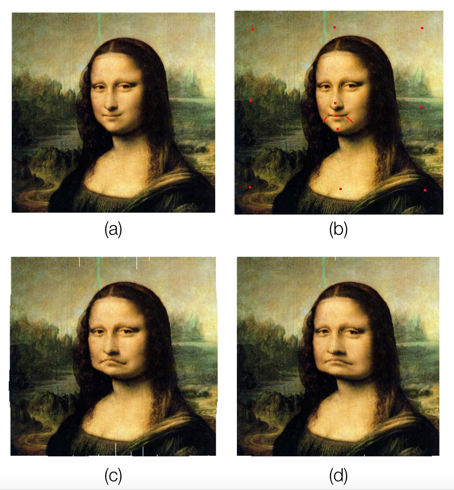

Image Warping with IDW and RBF
====
**ImageWarping** is a simple program that uses simple algorithms like **IDW(Inverse Distance Weighting)** and **RBF(Radial Basis Function)** to achieve image warping.

## Overview
This program provides a simple GUI for users to load a image, and choose corresponding algorithm to do the wariping operation. This document only provides a simple description for the algorithms, refer to paper [1] [2] if you want more detail.

### Image Deformation
Image Deformation (same as Image Warping, to some extent) means do the deformation operation on a image. The deformation opration is defined by some control points pairs (p\_i, q\_i). A control point p\_i in the original image moves to position q\_i in the warped image. The movement of all other points is decided by those control points.

### Scattered Data Interpolation
Scattered Data Interpolation is a method to solve Image Deformation Problem. It defines an interpolation function to do the interpolations for control points.

The algorithms used in this project are all based on Scattered Data Interpolation.

#### Sheperd Interpolation
Sheperd Interpolation, or called Inverse Distance weighting, uses **inverse distance** to evaluate influences of diffrent control points.

There are 2 sigma functions proposed in paper [1], both are realized in my code.

The first sigma function uses global distance influence, which means all points in a image will be influenced by any control point.

The second sigma function uses local distance influence, which means one control point only influence the points which is close to it. Users can set the distance threshold.

#### Radial Basis Functions
Radial Basis Functions uses linear combination of basis functions to do the scattered data interpolation.

### White Gap Problem
when a warping operation tends to strecth an image (which is to enlarge it), some white gaps will occur, because the number of original pixels is not enough to fill the new one.

So, we need to fill in those white gaps. I choose a very simple algorithm, for each "white"(or unmatched) pixel in the new image, fill it with the color of the nearest pixel from it.

## Dependencies
**QT 5.7.1** is used for compiling and running this program.

**Eigen** is used for solving linear equations, it is already included in the project (./Eigen)

## Experiment
A simple experiment is implemented on the famous painting: MonaLisa.

(a) is the original image.
(b) shows the control points (marked in red color). (c) is the warped image using IDW algorithm. (d) is the warped image using RBF algorithm.

From the images, wo may infer that IDW is more balanced in warping, while RBF may be more wild. However, the image using IDW appears to have more unhandled white gaps than RBF, this may be compensated by using more advanced algorithms to handle White Gap Problem, rather than just looking for the nearest point.

## Algorithm Complexity
**m** and **n** is the width and height of an image separatelt, and **k** is the number of control points **p**.

In the codes of IDW, I directly used the answer to the linear  equations provided in paper [2], ranther than using Eigen to solve it. While in the codes of RBF, I used Eigen to solve linear equations.

Obviously, those 2 methods have diffrent time complexities, and it is not always that we can solve the equations by hand and type the answers into computers. So, I assume now, all linear equations are solved by Eigen, which uses maxtrix operation.

There are diffrent methods to solve linear quations in Eigen, each may have different time complexity. I choose **ColPivHouseholderQR**, which has rather good speed(++) and high accuracy(+++).

QR, in general, takes *O(2\*a\*b^2)* if the size of the matrix is (a, b).
### IDW
For a warping opration using IDW, there are 2 stages:

1. compute the matrix *T*, which takes *O(k^2)* to compute the parameter, and *O(2\*4\*4^2)=O(1)*
2. do the warping opration for all points in the image, which takes *O(m\*n\*k)*.

So, the total time complexity is *O(k^2 + m\*n\*k)*.

### RBF 
For a warping operation using RBF, there are 3 stages:
 
1. compute r for each control point, which takes *O(k^2)*.
2. compute alpha matrix, which takes *O(2\*k\*k^2)=O(k^3)*.
3. do the warping operation for all points in the image, which takes *O(m\*n\*k)*.

So, the total time complexity is *O(k^3 + m\*n\*k)*.

## Reference
 
[1] *Image Warping with Scattered Data Interpolation, 1995*

[2] *Free Form Deformation with Scattered Data Interpolation Methods, 1992*

